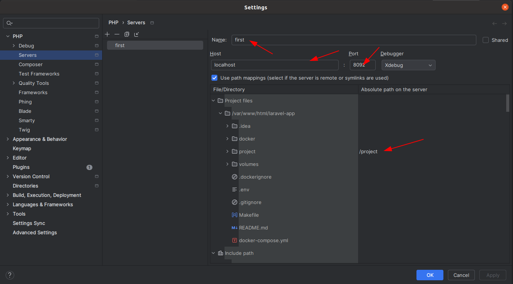
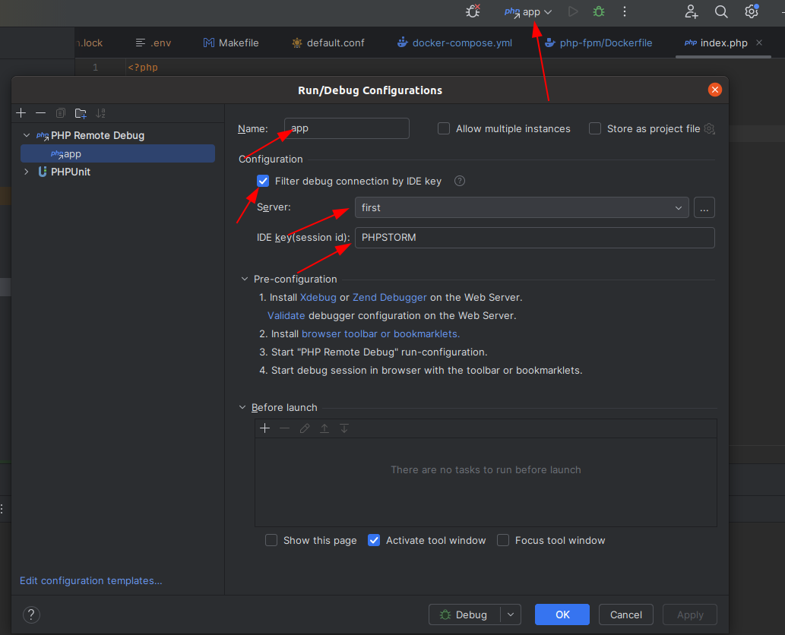

# laravel-app

1. Сменить репозиторий, чтобы не коммитить в шаблон
2. Изменить в корне .env файл, а именно APP_NAME(название проекта), DATABASE_NAME(название базы данных)
3. В каталоге project создать .env файл и скопировать туда содержимое из .env.example. Заменить в этом файле следующее:
	- APP_NAME(должно совпадать с APP_NAME из пункта 2)
	- DB_DATABASE(должно совпадать с DATABASE_NAME из пункта 2)
4. В файле docker-compose.yml изменить порты у сервиса nginx и db на свободные, а также название хранилища для базы данных(volumes в конце файла)

## xDebug
1. Создать сервер как на картинке и заполнить всё как на ней же. Порт выбрать который указан у контейнера nginx

2. Создать новую конфигурацию дебага как на картинке
   